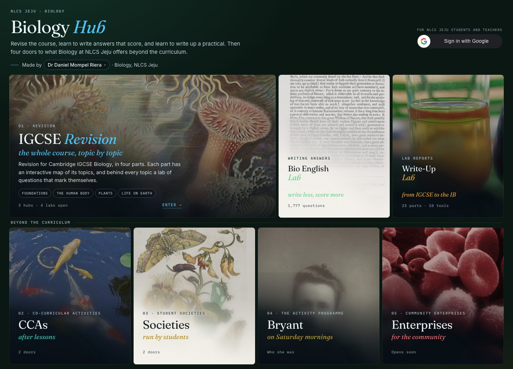

<h1>🧬 &nbsp;Biology Hub</h1>

**The front door to everything Biology does at NLCS Jeju.**

On the front row: IGCSE revision — Foundations, the human body, Plants, Life on Earth — with Bio
English Lab (writing exam answers) and Write-Up Lab (lab reports) beside it. Beneath them, four
doors to what the department does beyond the exam: the co-curricular activities, the student
societies, Bryant, and student enterprises. Below those, one door beyond NLCS: Learn R.

by **Dr Daniel Mompel Riera** · NLCS Jeju

---

## Where everything is

A student goes **front door → IGCSE Revision → a shelf → a lab**. Each shelf is a map you point
at; behind it are the labs, where the questions are and where they mark themselves. The other
four doors on the front lead to a page each: `…/#ccas`, `…/#societies`, `…/#bryant` and
`…/#enterprises`. `…/#revision` opens the revision hub directly, and the older links still
work — `…/#plants` opens that shelf and `…/#y10` opens a year.

| Door | Topics (0610) | Behind it |
|---|---|---|
| **Foundations** | 2 · 3 · 4 · 5 | being built |
| **The human body** | 7 · 9–16 | [Human Body Hub](https://nlcsbiology.com/human-body-hub/) 🟢 · [Digestion Lab](https://nlcsbiology.com/digestion-lab/) 🟢 · [Circulation Lab](https://nlcsbiology.com/circulation-lab/) 🟢 |
| **Plants** | 6 · 8 · 14.5 · 16.3 · 18.2 | [Plants Hub](https://nlcsbiology.com/plants-hub/) 🟢 · [Plants Lab](https://nlcsbiology.com/plants-lab/) 🟢 |
| **Life on Earth** | 1 · 17–21 | [Life on Earth Hub](https://nlcsbiology.com/life-on-earth-hub/) 🟢 · [Classification Lab](https://nlcsbiology.com/classification-lab/) 🟢 |

Also here: the [Protein & Enzyme Sim](https://nlcsbiology.com/protein-enzyme-sim/), and an
[IB B1.1 practical](https://nlcsbiology.com/B11-starch-calibration-curve-pract/) behind the
**IB extension** toggle. The three year tabs show which topics each year meets, the year of its
IGCSE exams and which syllabus those follow; `…/#y10` opens a year and `…/#plants` opens a door —
both are useful links to hand a class.

**Progress follows the student.** Each lab remembers what they have answered, and this page adds
it up — a bar per shelf, and the same figure on each door. Signed in, what the labs have saved
comes back from the spreadsheet below, so a cleared browser does not start from nothing.

## Two editions

This is the **NLCS Jeju** edition, with the school's own doors. The
[open edition](https://github.com/Mompel226/igcse-biology-hub) carries none of that and names no
school — that is the one to share with another teacher. They are the same site from the same
files; only `js/local.js` differs.

---

## 📊 Would you like to see how your students are doing?

**You can — every score, every class, in one Google Sheet of your own.**
It takes about half an hour, once, and you do not need to know any code.

**One** Google Sheet, with a tab per lab — every lab you use reports into the same one. Each tab is your class list: every student has a row from
the moment you import them from Google Classroom, and each save fills theirs in — score,
percentage, how many checks it took, how many they got right first time, how long they worked.

<table>
<tr><td colspan="2" align="center">

**🧑‍🎓 Your student signs in with Google &nbsp;→&nbsp; works through a lab &nbsp;→&nbsp; the lab saves on its own**

</td></tr>
<tr>
<td width="50%" valign="top">

#### ✅ &nbsp;On your class list

Their row fills in on **your** Sheet — score, percentage, and the work behind it.

</td>
<td width="50%" valign="top">

#### 🌍 &nbsp;Anyone else in the world

**Nothing is saved, anywhere.** No row, no name, no email. Their work stays in their own browser.

</td>
</tr>
</table>

> [!IMPORTANT]
> **The labs stay open to everyone.** Work is recorded **only** when the Google account
> that signed in is on your class list. For everybody else nothing is written down at all —
> no row, no name, no email. That decision is made on the server, so it holds.

<h3>👉 &nbsp;Open this to set it up — step by step</h3>

 

### Before you start

You will need three things, all free:

| | |
|:--:|---|
| 🐙 | **A GitHub account** — [github.com/signup](https://github.com/signup). This is where your own copies of the labs will live. |
| 📗 | **A Google account** — your school one. It holds the spreadsheet. |
| 🏫 | **Google Classroom** with your classes in it, so the student names import themselves. |

---

### Step 1 · Make your own copy of a lab 🐙

> ### ⚠️ &nbsp;The step people skip
> **Nothing works without it.** If you share *my* links with your students, their work goes
> to *my* script — and since they are not on my class list, nothing is saved for anyone. You
> need your own copy, at your own web address, pointing at your own spreadsheet.

You do not need to know GitHub. It is three clicks and one edit.

| # | Do this |
|:--:|---|
| **1** | Go to **[github.com/Mompel226/digestion-lab](https://github.com/Mompel226/digestion-lab)** and press **Fork** (top right) ▸ **Create fork**. You now have your own copy. |
| **2** | In *your* copy: **Settings ▸ Pages**. Under *Branch* choose **master**, folder **/ (root)**, **Save**. Wait a minute or two. |
| **3** | Your lab is now live at **`https://YOUR-USERNAME.github.io/digestion-lab/`**. Open it and check it loads. Write that address down — you need it twice below. |

*(To change a file in your copy: open it on GitHub, press the **✏️ pencil**, edit, then
**Commit changes**. That is all the GitHub you need.)*

#### Do you want the hub as well?

The hub — the body you point at to choose a lab — is only a signpost. **No marks pass through
it**, so you can skip this entirely and just give your students your lab link. But if you want
the whole thing under your own name, and you want it pointing at *your* labs rather than mine:

| # | Do this |
|:--:|---|
| **a** | Fork **[Mompel226/human-body-hub](https://github.com/Mompel226/human-body-hub)** the same way. |
| **b** | In your fork: **Settings ▸ Pages** ▸ branch **main** ▸ **Save**. It goes live at `https://YOUR-USERNAME.github.io/human-body-hub/`. |
| **c** | Open **`js/topics.js`**, press the ✏️ pencil, and change every `url:` to your own fork's address — `https://YOUR-USERNAME.github.io/digestion-lab/` and so on for each lab you host. **Commit changes.** |
| **d** | Share **your** hub link with your classes. |

> ⚠️ &nbsp;**If you skip step c**, your hub will send your students to *my* labs, which post to
> *my* spreadsheet — and since they are not on my class list, nothing is saved for anybody. The
> `url` in `js/topics.js` is the only thing that decides where a student ends up.

---

### Step 2 · Build the spreadsheet 📗

| # | Do this |
|:--:|---|
| **4** | Make a **new Google Sheet**. The name does not matter. |
| **5** | In it: **Extensions ▸ Apps Script**. Delete whatever is there and paste in **[`Code.gs`](apps-script/Code.gs)** — open that file and use GitHub's copy button. [The list at the bottom of this page](#the-four-files-to-paste) has all four files. |
| **6** | Press **+** beside *Files* ▸ **HTML**, three times, and name the three files exactly `ClassroomImport`, `Teacher` and `TeacherPage`. Paste into each the file with the same name: **[`ClassroomImport.html`](apps-script/ClassroomImport.html)**, **[`Teacher.html`](apps-script/Teacher.html)** and **[`TeacherPage.html`](apps-script/TeacherPage.html)**. Save. |
| **7** | In the left sidebar, beside **Services**, press **+** ▸ choose **Google Classroom API** ▸ **Add**. Leave the identifier as `Classroom`. |
| **8** | **Run ▸ `setup`**, and authorise when asked — it is your own script, on your own Sheet. It builds and formats every tab. |

> 💡 &nbsp;**There is no id to paste anywhere.** The script sits inside your Sheet, so it
> works out which one it is the first time you run it, and remembers.

---

### Step 3 · Switch on sign-in 🔑

Signing in is how the spreadsheet tells *your* students from the rest of the world, so
**nothing at all is recorded until this is done.** It is the fiddliest step; take it slowly.

A **Client ID** is a name-tag for your app, issued by Google. It is not a password and not a
secret — it sits in plain sight in the page. One long string ending
`.apps.googleusercontent.com`, and it goes in **two places, the same string in both**.

| # | Do this |
|:--:|---|
| **9** | Go to **[console.cloud.google.com](https://console.cloud.google.com)** and pick a project, or make one — any name, it is just a container. |
| **10** | In the search bar type **Google Auth Platform** and open it. On a new project it shows **Get started** and walks you through four short screens: **App information** (an app name, and your own email as the support email) ▸ **Audience** — choose **External** ▸ **Contact information** (your email again) ▸ agree and **Create**. Nothing here is public unless you publish it, and none of it needs a website or a privacy policy. |
| **11** | Now in the left-hand menu: **Audience ▸ Publish app** ▸ confirm. It should read **In production**, not *Testing*. |
| **12** | Left-hand menu: **Clients ▸ Create client** *(the older console calls this **APIs & Services ▸ Credentials ▸ Create credentials ▸ OAuth client ID** — both land in the same place)*. **Application type: Web application**. Give it any name. |
| **13** | Under **Authorised JavaScript origins** press **+ Add URI** and enter exactly **`https://YOUR-USERNAME.github.io`** — your address from step 3, **no path, no trailing slash, no `/digestion-lab`**. Leave **Authorised redirect URIs** completely empty. Press **Create** and copy the **Client ID** (it ends `.apps.googleusercontent.com`). |

> ### ⚠️ &nbsp;Three things that catch people out here
> **Step 10 must come before step 12.** Google will not issue a client id until the consent
> screen exists — go straight to *Create client* and it bounces you back.
>
> **Step 11 is not optional.** Left on *Testing*, only accounts you list by hand can sign in
> and everyone else is told *“access blocked: this app has not completed verification”*.
> Publishing needs no review here: signing in asks for a name and an email address only, which
> Google counts as **non-sensitive** — so there is no waiting and nothing to submit.
>
> **The origin has no path.** `https://YOUR-USERNAME.github.io` — not
> `https://YOUR-USERNAME.github.io/digestion-lab/`, and no trailing slash. Google matches the
> origin exactly, and the commonest failure is a sign-in button that appears and then does
> nothing.
>
> *Google redesigns this console fairly often. If a screen does not look like the above, the
> three things you are looking for are always the same: a **consent screen / Branding** page,
> an **Audience** page with a **Publish** button, and a **Clients / Credentials** page that
> makes a **Web application** client.*

---

### Step 4 · Join the two together 🔗

| # | Do this |
|:--:|---|
| **14** | In the Apps Script editor, paste your Client ID into **`CLIENT_ID`** at the very top of `Code.gs`. |
| **15** | **Deploy ▸ New deployment ▸ Web app.** *Execute as* **Me**, *Who has access* **Anyone**. Press **Deploy** and copy the **`/exec` URL**. |
| **16** | In **your fork** of the lab, open **`js/config.js`**, press the ✏️ pencil, and fill in two lines — `submitUrl:` your `/exec` URL, and `googleClientId:` the same Client ID as step 14. **Commit changes.** |

> ### 🔁 &nbsp;Remember this one for ever
> **Every time you edit the script from now on:** Deploy ▸ Manage deployments ▸ **✏️ pencil**
> ▸ *Version* ▸ **New version** ▸ Deploy. Editing alone changes nothing. Use the pencil rather
> than *New deployment* and the URL stays the same, so you never touch `config.js` again.
> Do it on each deployment you have: this one, and the teacher page's if you make one (below).

---

### Step 5 · Bring your classes in, and test it 🎓

| # | Do this |
|:--:|---|
| **17** | In your Sheet: **🧪 Biology Labs ▸ Import students from Classroom…** Tick your courses, check the class codes it guesses, **Import**. Every lab tab fills with names. |
| **18** | Open **your** lab link, sign in as yourself (the button at the top right) and answer one question. Within two minutes the lab saves it. |

If you are on the Students tab, your row fills in. If you are not — you are the teacher, after
all — nothing is saved, which is the system working. Add yourself to the **Students** tab by
hand to try it: unhide the *School email* column, and type your name, a class and your email
into an empty row.

> ### ✅ &nbsp;From now on, share your own link
> `https://YOUR-USERNAME.github.io/digestion-lab/` — not mine. That is the one wired to your
> spreadsheet.

---

### When something is wrong 🩺

Start with **🧪 Biology Labs ▸ Check the set-up**. It says in one box whether the Sheet is
found, whether Classroom is switched on and authorised, **whether sign-in is set up**, and how
much is in there.

| What you see | What it means |
|---|---|
| `Script function not found: …` | the pasted script is older than its menu — re-paste [`Code.gs`](apps-script/Code.gs) in full |
| `Classroom is not defined` | step 7 was missed — Services ▸ + ▸ Google Classroom API ▸ Add, then run `setup` |
| `Illegal spreadsheet id or key: …` | the **deployment** is older than the editor — redeploy with the ✏️ pencil, *New version* |
| the import window lists no courses | that Google account has no **active** Classroom courses |
| the import window says only the owner or a listed teacher can import | you are signed in to the Sheet as somebody else — its owner, or a teacher added under **👥 Teacher page: teachers and addresses**, runs it |
| no sign-in button on the lab | `googleClientId` is empty in your fork's `js/config.js` |
| `access blocked: this app has not completed verification` | step 11 was missed — Audience ▸ **Publish app** |
| sign-in works, but nothing reaches the Sheet | `CLIENT_ID` is empty, is a different string from `googleClientId`, or the deployment is stale |
| a lab's tab has no names in it | nobody has been imported yet — step 17 |
| everything is set up, but **no** student appears | you shared my link, or your hub's `js/topics.js` still points at my labs. Your students must open **your** address — `https://YOUR-USERNAME.github.io/digestion-lab/` |
| a stranger signs in and nothing is recorded | working as intended 🌍 |

---

## 🎓 The record card, top right

<b>Sending a student to their own reflection page — and why it reads the tracker, not an assessment</b>

 

The Assessment Reflection System builds every student a page of their own after each test:
their scores, the topics they were weak on, what to revise next. The card top right takes
them to it.

**Two things decide the shape of this, and both are easy to get wrong.**

**One — there is no per-student link.** The page works out which student to show from the
Google account that opens it, checked at the far end, and its deployment is restricted to
the school's own domain, so Google refuses anyone else before a line of script runs. A
student who opens the bare address gets their own page and nobody else's. Nothing to look
up, nothing to hand out, nothing that could carry one student's address into another's
browser.

**Two — there is no single assessment spreadsheet either.** Each assessment gets its own
spreadsheet, its own copy of the reflection script, its own deployment and so its own
address, and a fresh one is made for the next test. But every one of them writes into the
**same** workbook: *Student Progress Tracker*, in the *Master Tracker* folder, which keeps
**one row per student per assessment**. That workbook is what the student's page actually
renders from — which is why all those different addresses show a student the same page.
They are windows onto one thing.

So the card asks the **tracker**. Point it at one assessment's spreadsheet and it would
know about that test and no other, and would go stale the day you make the next one. Pointed
at the tracker there is nothing to re-point, ever.

| What comes back | What the card says |
|---|---|
| on the list, has reflected | their name, and **My assessments · *r* of *n* reflected →** — *n* counts every assessment with a real score, reflected on or not, once each; *r* the reflections they finished |
| has an unfinished reflection | **… · *k* unfinished** — counted apart, never added in. The card still links through, because the page says what is missing and why |
| practice in a lab or Bio English, but no reflection yet | **My assessments · your practice →** — My assessments shows their practice too |
| on the list, nothing recorded yet | their name, and *Your assessments start at your first reflection* — no link to an empty page |
| a teacher in test mode who has only used the TEST class | **My test assessments · …**, or *Test mode · no test reflections yet* |
| a teacher in teacher mode | **Assessment system →**, the teacher page (below) |
| signed in with a personal account | *Use your …nlcsjeju.kr account*, with the sign-in button again |
| not signed in | Google's own **Sign in with Google** button |
| the check cannot be reached | *Could not check just now — try again* |

The same line stands on a **My assessments** door beside the revision door, which appears only for a
signed-in student who has something there.

Matching is on the **email**, never the name — the same rule as the class list. The `TEST`
tab is **included**: students never have rows there, so it changes nothing for them, and it is
what lets you test the reflection form as yourself and see the card behave as a student's would.
A row with no AssessmentID is ignored — older copies of the reflection script could append those.

**Unfinished reflections** are read from their own tab in the tracker, *Unfinished reflections*,
which the updated reflection script writes when a student submits incomplete. They are counted
apart from finished assessments, and a paper that also has a finished row counts as finished.
That tab's email column is headed **Student Email** on purpose: older copies of the reflection
script look for a column called *Email*, so they never see these rows and can never show one to a
student as a 0% result.

**To switch it on** — three things, and it stays off until all three are done:

1. `TRACKER_ID` and `SCHOOL_DOMAIN` at the top of `apps-script/Code.gs`. `TRACKER_ID` is the
   long string in the **Student Progress Tracker**'s address, between `/d/` and `/edit` —
   *not* an assessment's spreadsheet. Both are remembered in Script Properties, so pasting
   a fresh copy of the script over the top never wipes them.
2. **Deploy ▸ Manage deployments ▸ ✏️ ▸ Version: New version ▸ Deploy.** Editing alone
   changes nothing, and until you do this the card says *could not check just now*.
3. The `record` block and `googleClientId` in `js/local.js`. `record.url` is the address of
   the student page — any deployment's will do, with `?page=student` on the end. Without
   that suffix the address opens the reflection **form** instead of the record. It is the
   fallback: the card and the door open the address that the newest reflection copy writes into
   the tracker's **🚪 My assessments address** tab (the labs script hands it to the hub), and use
   `record.url` only until a copy has registered there.

Then **🧪 Biology Labs ▸ 🩺 Check the set-up** names the tracker back to you, lists its
cohort tabs and counts the rows in them. If you have pasted an assessment's spreadsheet by
mistake it says so — that sheet has no *Class of ____* tabs, which is how it can tell.

Leave any of it empty and no card appears; nothing else on the page changes.

---

## 👩‍🏫 Teacher mode, and the teacher page

<b>A page only your Biology teachers can open: spreadsheets, lab progress, Bio English, students, homework and homework habits</b>

 

Signed in on the hub as a teacher, the corner card gains a **Teacher | Test** switch.
**Test** shows you the hub exactly as a student sees it, from your own TEST reflections.
**Teacher** replaces the student's door with **Assessment system**, which opens the teacher page.
It has six tabs:

| Tab | What it shows |
|---|---|
| **Spreadsheets** | every spreadsheet you put on it — each assessment's, the test copies, the tracker — grouped by **cohort, the year they graduate** (in 2026–27, Y10 is Class of 2028), with the current year group (Y9/Y10/Y11) worked out for you, so it never goes stale. Records are pinned at the top; within a cohort the spreadsheets are grouped by **type** (Reflection · Test · Survey · …, colour-coded). There is a **search box**, **filter chips** by type, an **Only current cohorts** toggle (on by default) that hides cohorts who have left, and a **Copy** button on every card for pasting into Google Classroom or an email. |
| **Lab progress** | how each class is doing in the labs: every student against every lab, who needs a look, and the stations a class finds hardest |
| **Bio English** | how far each student has got with the Bio English Lab sets of their year |
| **Students** | find any pupil and open their own reflection tracker, the same page they see |
| **Set homework** | pick lab stations and Bio English sets, set them for a class with a due date (and a time, if you want one), post them to Google Classroom if you like — each station named, one link for each lab (it opens the lab at the first homework station), under a Classroom topic you choose or type — and see who has done them, sorted by due date or by class. If you tick *Remind pupils who have not finished*, the pupils who have not finished get two reminders in Google Classroom that only they can see, when 70% and 85% of the time to the due time has passed (about 2 days and 1 day before a week's homework; never between 22:00 and 07:00). This needs one more Google permission, for Classroom announcements: after pasting, run `checkSetup` once in the Apps Script editor and allow it. Signed-in students see their homework stations coloured in each lab: red not started, orange part done, green done. The Classroom post carries no marks: those stay in your Sheet |
| **⏱️ Homework habits** | when each pupil finishes each homework, against the time it was set and its due time: *done before it was set*, *early* (by half the time), *in good time* (by 85%), *last minute*, *late*, *not done* or *still open*; ⏰ when they finished after a reminder had gone to them; their checks and right first time; and the time *from their first try to their finish* (between two saves: never time spent working). Each pupil gets a habit line from their last six homework (*Usually early*, *Usually in good time*, *Usually the last minute*, *Often late or not done*, *Only after a reminder*, *Getting better*, *Getting worse* or *Mixed*), and a neutral *Worth a look* when a homework is finished very fast and almost all right first time by a pupil whose results are usually low (teacher-marked tests under 50%): a reason to talk with them, never proof of anything. Pick a class; click a name for that pupil's timeline. The times are kept, per station, from the first save after the script is pasted |

If you also run the analysis website (its own script in the Student Progress Tracker), the teachers on its 👥 list see
**📊 Analysis ↗** at the end of the tab row; it opens the website in a new tab. Nobody else sees it, and the list stays in
the tracker: the page is told only the website's address.

**Nothing about that page is in this website.** Not its address, not a spreadsheet link, not who
the teachers are, not a single pupil or mark. It is guarded twice:

1. **By Google.** The page is served by a *second* deployment of the labs script whose access is
   **Anyone within** your school. Google signs the visitor in with their school account before a
   line of script runs, so a sign-in copied out of a web page is no use: what opens it is Google's
   own sign-in, which no page can read.
2. **By the script.** It opens only for you (the script's owner) and the teachers you add in the
   window below (or type into `TEACHERS`) — and only at your school's own domain, so a pupil's
   address added there by mistake still opens nothing. Anybody else sees who the page is for, and
   not a single link, name or mark. This check stands on its own too: the labs deployment, which is
   open to anyone, would serve the page as well, and there the script's check is the only guard.

A link on the page opens only for the people that spreadsheet is shared with. The page lists your
spreadsheets; it does not share them.

**To switch it on** — everything is done in one window in the labs spreadsheet, which the
**🧪 Biology Labs** menu opens in two places: **👥 Teacher page: teachers and addresses…** (the page's
addresses and the teachers) and **🔗 Add or remove links on the teacher page…** (the links). You never
edit the code for any of this:

1. **Make the page's own deployment, once.** In the Apps Script editor: **Deploy ▸ New deployment ▸
   ⚙ ▸ Web app**, Execute as **Me**, Who has access **Anyone within** your school — *not* "Anyone".
   Deploy, and copy the **Web app URL**.
2. Open **👥 Teacher page: teachers and addresses…** from the menu. Under **Set up once**, paste that
   URL into **The page address** and Save; the tracker's address (**Open a student's tracker**, for
   the Students tab) and the hub's address (**Set homework**) go there too. Add the other Biology
   teachers by name and school address. Then, in **🔗 Add or remove links on the teacher page…**,
   press **🔎 Find new reflection and test spreadsheets**: it adds every reflection and test
   spreadsheet that has labelled itself in your Drive. Add a row by hand for anything else — records,
   surveys, a colleague's spreadsheet — with its **Type** (Reflection, Test, Survey…), the
   **Assessment**, the **Graduation year** (the cohort — in 2026–27, Y10 is 2028 and Y9 is 2029), and
   the **Link**. The same test for another cohort is another row; the page groups by cohort and works
   out the current year group (Y9/Y10/Y11) itself.
   A row may also carry a **Dashboard** address. Both the test system and the reflection system serve
   a live teacher dashboard at their own web-app address ending `/exec?page=dashboard`; put it there
   and the card offers it beside the spreadsheet, so reaching the dashboard no longer means opening
   the spreadsheet first and hunting for the link inside. Leave it blank and the card is unchanged.
3. That is all. Teachers, links and the addresses are read live, so anything you add or change here
   takes effect at once on the page, and on the hub within a minute — no new version, no redeploy.
   (A redeploy is only ever needed when the **code** itself changes.)

The first time you run anything after pasting this version, Google asks for one new permission —
to see the email address of whoever opens the teacher page. Allow it **before** deploying the labs
endpoint, or the labs stop answering until you do: run **🩺 Check the set-up** once, allow, then
deploy.

**🩺 Check the set-up** reports the page's address, how many teachers can open it and how many links
are on it. (The older `TEACHERS` / `TEACHER_PAGE_URL` lines near the top of the script still work as
a fallback, but the window is the easy way.)

---

## 🧪 "Sit a test" — a banner for a test that is coming or open

<b>How a student finds their test, and when it opens</b>

Under the credit on the front page, a signed-in student sees one amber banner while they have a test
that **opens later** (*"Opens today at 09:00. The link appears here when it opens."* — no link yet) or
is **open now** (a live dot and **Sit the test →**). Nobody else sees anything. It opens the test in
the same tab, on purpose: the test counts every time a student leaves its tab.

It needs three things:

1. **The Test System, from 18 Sep 2026 on** — its `Code.gs` and `2_TestPlatform.gs`. It then keeps a
   **⏰ Hub schedule** tab in its own spreadsheet, rewritten whenever a start or close time, the
   active test or its web-app address changes, and each time the spreadsheet is opened. The times on
   the banner are worked out by the test system's own rules — class windows, personal overrides,
   extra time — so they always agree with what the test itself will do.
2. **A row in 🔗 Teacher links** with Type **Test** whose **Link is that test spreadsheet** (typed, or
   pasted as a chip — both are read).
3. **This script redeployed** (✏️ pencil ▸ New version) — both deployments, the labs endpoint that
   answers the banner and the teacher page.

Two more cards come in the same answer, so they cost the hub nothing more:

- **New feedback** — for five days after you release a pupil's marked test in the Test System's
  Marker Review, a card names the test and offers **See your feedback →**, the Test System's own
  read-only feedback page. After that the feedback is still on My assessments.
- **Your reflection** — for a reflection spreadsheet you switch on for the hub (in that
  spreadsheet: 🧰 ToolBox ▸ 👥 Classes & rostering ▸ **📣 Share the form link…** (answer 2, the Biology Hub), which
  writes a row in the tracker's **📣 Reflections on the hub** tab), each pupil on its Marks tabs sees
  **Start your reflection** or **Continue your reflection**, worked out by the form's own rules — or,
  if they handed in only part of it or ran out of time, a reminder to ask you. It goes once they have
  handed in a complete reflection.

A teacher sees exactly what a student would, in **test mode**, once they are on the test's
**Marks · Test** tab (the test system's 🧑‍🏫 Set up Teacher Test tab); in teacher mode it stays hidden.

What it is told is only that person's own: whether they have a test, its name, when it opens and
closes for *them*, and the way in — which is accepted only if it is a Google Apps Script web app.
Never a class's times, anyone else's, or a single question.

## 🗂️ Once it is running — what you actually do

<b>What each tab holds</b>

 

| Tab | What is in it |
|---|---|
| 🟢 **Students** | the dashboard — every student, their class, and their best score in **every** lab, red through amber to green; a lab not built yet has a paler heading and an empty grey column |
| 🟢 **Digestion**, **Circulation**, … | one tab per lab, and each is your class list again: a row per student from the moment they are imported. Its last column, *Station times* (hidden), notes when each station was first tried and first finished, for ⏱️ Homework habits |
| 🟢 **✍️ Bio English** | a row per student, made at their first save in Bio English Lab: keyword and answer-writing questions answered, how many right first time, sets finished; the last column, *Set times* (hidden), notes when each set was first tried and first finished |
| 🟠 **📚 Homework** | a row per class for each piece of homework set from the teacher page — you may change its title, its due date, or its reminders (Remind: on or off) here; the last columns say when each reminder went and to how many pupils, never who |
| 🟣 **👩‍🏫 Teachers** | the other teachers who may open the teacher page |
| 🔵 **🔗 Teacher links** | the spreadsheets the teacher page lists |
| 🟡 **Labs** | one row for each lab in the script, written afresh by every Tidy up, and how many saves each has had |
| 🟡 **Setup** | what everything is, your web app URL, and the tick-box buttons |
| 🔴 **Rejected** | a save from one of your students whose numbers did not add up, with the reason |

Every tab explains itself: hover a heading to see what the column is for. A **dark green
heading** is filled in for you; an **amber heading with a ✎** is yours to change.

**Importing a class formats everything** — there is nothing to press afterwards. Run the
import again whenever somebody joins: students are keyed on their school email, so it adds
the new ones, moves anyone whose class changed, and never duplicates.

**Nothing is handed in.** Signed in, a lab sends the work on its own — two minutes after the
last check, and at once when the lab is finished or the page is left — and every save updates
the same row. *Saves* counts them and *Last saved* always moves, but the score is replaced only
when the new attempt **beat** the old one, and the carried answers only ever grow — a careless
re-run, or a second device that knows less, cannot wipe out a good result. Work done signed out
stays in the browser and is sent the moment the student signs in.

<b>What is on the menu</b>

 

| 🧪 Biology Labs ▸ | What it does |
|---|---|
| **🎓 Import students from Classroom…** | the main one. Adds new students, then builds and formats everything |
| **🩺 Check the set-up** | is the Sheet found, is Classroom on and authorised, is sign-in set up — and each optional part: the record card, the teacher page, homework, the morning email, the homework reminders and the Classroom permission they need |
| **📊 Refresh everyone's progress** | re-reads the lab tabs into the dashboard |
| **🎨 Tidy up** | rebuild anything missing, write the **Labs** tab afresh from the script's list of labs, and re-apply the formatting |
| **🔗 Add or remove links on the teacher page…** | the spreadsheets the teacher page lists — see *Teacher mode* above |
| **🔎 Find new reflection and test spreadsheets** | adds to the teacher page every reflection or test spreadsheet that has labelled itself in Drive and is not listed yet |
| **👥 Teacher page: teachers and addresses…** | the page's addresses (the page, the tracker, the hub), and who may open it |
| **🤝 Let the teachers on the list edit this spreadsheet…** | gives each teacher on the list edit access to this Sheet, after one question that names them. Only addresses at the school's own domain; nobody is ever removed. An editor can change any cell and open the script |
| **📬 Email me when homework falls due (every morning)** | at about 7:00 each teacher gets a summary of their homework that has just fallen due: who finished, who started, who did not |

*Refresh everyone's progress* and *Tidy up* also sit as tick-box buttons on the **Setup** tab.
The import opens a window, which a spreadsheet button is not allowed to do.

<b>What happened to completion codes</b>

 

Until September 2026 every hand-in showed the student a code (`DL-3CL9-Q3MP`) and the Setup
tab could read one back. It was a checksum the page itself computed, so it proved nothing a
student could not simply tell you, and now that a lab saves on its own the case it existed for
— the hand-in that never arrived — no longer happens. There is nothing to check: look at the
lab's tab. The *Code* column is kept, hidden, for rows that carry old ones.

<b>Why “Who has access: Anyone” is safe</b>

 

It has to be *Anyone*, because the labs are ordinary web pages with no login: the student's
browser posts to the script as a stranger. *Anyone with a Google Account* makes the browser
follow a sign-in redirect instead, and the work never arrives.

It does **not** share your spreadsheet. Nobody gets access to the Sheet, to Classroom or to
your Drive. The URL answers a **GET** that says the endpoint is running (with `?page=…`, the
teacher page, which opens only for a teacher on your list), and **POSTs** from the labs and Bio
English Lab: a save, which fills in one row — only for a signed-in account on your Students tab —
and a request for a signed-in student's own scores, record or test times, answered about them and
nobody else. A stranger with the URL cannot write anything, and cannot read a single mark.

A save from one of your own students that does not add up — a score above the total, an
impossible total — goes to the **Rejected** tab with the reason, never into a lab's tab. And a forged row usually looks forged: 113/113 in 113 checks, 0 right first time,
"0 min" since starting. Sort by *Checks* and it stands out.

To collect nothing at all, leave `submitUrl` or `googleClientId` empty: every student's work
stays in their own browser and nothing is posted anywhere.

---

---

## The four files to paste

They are in this repository — open, select all, copy. `Code.gs` goes into the script's own **Code** file; each of
the other three goes into an HTML file with the same name.

| File | What it is |
|---|---|
| **[`apps-script/Code.gs`](apps-script/Code.gs)** | the whole script: receiving each student's work, the roster, the tabs, Classroom import, and giving a student their own scores back |
| **[`apps-script/ClassroomImport.html`](apps-script/ClassroomImport.html)** | HTML file `ClassroomImport`: the little window that imports your classes |
| **[`apps-script/Teacher.html`](apps-script/Teacher.html)** | HTML file `Teacher`: the teacher page — Spreadsheets, Lab progress, Bio English, Students and Set homework |
| **[`apps-script/TeacherPage.html`](apps-script/TeacherPage.html)** | HTML file `TeacherPage`: the window behind **🔗 Add or remove links on the teacher page** and **👥 Teacher page: teachers and addresses** |

---

## For developers

Static files. No build step beyond `node tools/stamp.mjs`, which first copies in what the site
shares with the labs, when it finds `labs-shared/` above this folder (the lab register as
`js/data/labs.json` and `labs.js`, `js/progress.js`, `js/signin.js`, `js/data/stations.json` and the
syllabus years), then rewrites
every `?v=` stamp in `index.html` and `applications.html`, and `version.txt`, from one value —
never hand-edit `version.txt`, the stamps are the real cache key.

- **`js/shelves.js`** — the register: doors, year groups, what is open, image credits.
- **`js/local.js`** — the school layer, and the only file the two editions do not share.
- `js/data/labs.js` — generated from `labs-shared/labs.json`, the single register of labs.
- `js/progress.js` — the only code that knows how to read a lab's progress record.
- `apps-script/` — the marks system, above. `node tools/gastest.js` runs it against stand-in
  Google services; every line must say ok.

`node tools/deploy.mjs` stamps this edition, syncs the shared files to the open one and stamps
that too, so the two cannot drift.

## The pictures

Every door image is public domain, CC0, or a Creative Commons licence that permits this use, and
each is credited on the page and in [`assets/doors/CREDITS.md`](assets/doors/CREDITS.md).

Made by **Dr Daniel Mompel Riera** · Biology, NLCS Jeju ·
[dmompelriera@nlcsjeju.kr](mailto:dmompelriera@nlcsjeju.kr)

## Licence

| What | Licence |
|---|---|
| **The software** — everything that runs: JavaScript, Apps Script, Python, Swift, HTML structure, CSS, build tools | [AGPL-3.0](LICENSE) |
| **The teaching material** — question text, explanations, diagrams and images I made, wherever they are stored | [CC BY-NC-SA 4.0](LICENSE-CONTENT) |

**In plain English.** Use it, change it, run it for your students — free, and you never need to ask.
If you change the software and let anyone else use it, *including over a network*, you have to publish
your source under the same licence. You may not sell the teaching material or use it commercially, and
the credit has to stay.

**Not covered:** third-party images and media keep their own licences — see the picture credits.

© 2026 Dr Daniel Mompel Riera. I hold the copyright, so I can grant other terms: if you want to use any of
this commercially, ask me at <dmompelriera@nlcsjeju.kr>.
